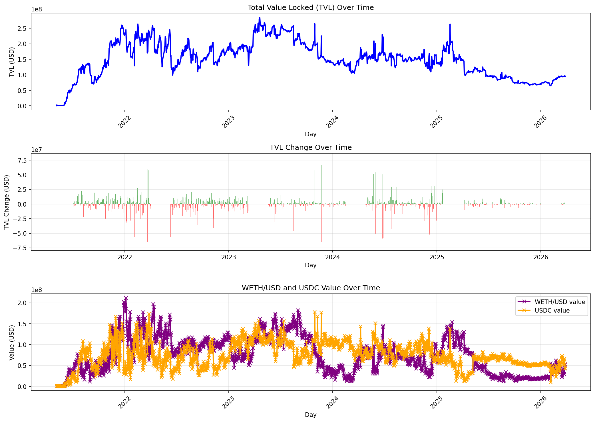
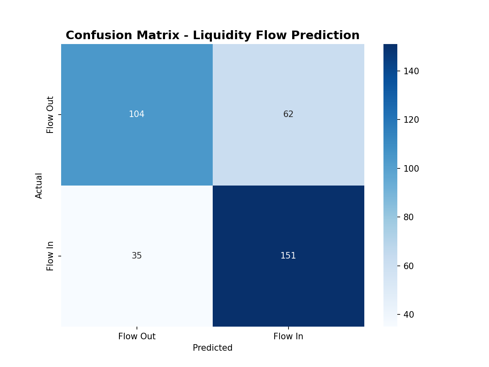
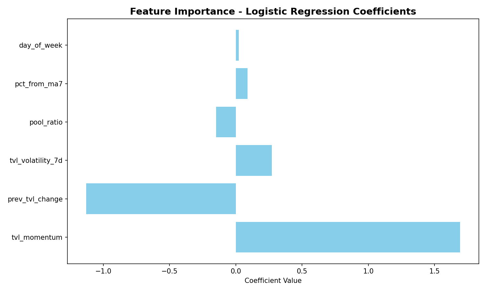

# Uniswap Liquidity Flow Predictor

Machine learning model predicting daily liquidity movements in the USDC/ETH Uniswap V3 pool.

## Problem Statement

Understanding when liquidity providers will add or remove liquidity helps traders, protocols, and market makers optimize their strategies. This project uses 5 years of historical pool data to predict future liquidity flows.

## Approach

### Data Collection
- **Source:** Dune Analytics
- **Pool:** Uniswap V3 USDC/ETH (0.05% fee tier)
- **Contract:** 0x88e6a0c2ddd26feeb64f039a2c41296fcb3f5640
- **Period:** May 2021 - March 2026
- **Records:** ~1,800 daily snapshots
- **Target:** Binary classification (liquidity IN vs OUT)

### Feature Engineering

Created 8 predictive features from raw TVL data:

1. **prev_tvl_change** - Previous day's TVL change (momentum)
2. **tvl_momentum** - Deviation from 7-day moving average
3. **pool_ratio** - WETH dominance percentage
4. **tvl_volatility_7d** - 7-day rolling standard deviation
5. **day_of_week** - Temporal pattern (0=Monday, 6=Sunday)
6. **month** - Seasonal effects
7. **pct_from_ma7** - Percentage deviation from 7-day average
8. **tvl_ma_30d** - 30-day trend indicator

### Model

- **Algorithm:** Logistic Regression (scikit-learn)
- **Train/Test Split:** 80/20 stratified split
- **Validation:** Classification metrics, confusion matrix
- **Accuracy:** 72.44%

## Results

The model achieved **72.44%** accuracy in predicting liquidity flow direction, outperforming the 50% random baseline.

## Visualizations

*5-year TVL history showing bull/bear market cycles*

*Model prediction accuracy breakdown*

*Which factors drive liquidity flows*

## Tech Stack

- **Python 3.x** - Core programming language
- **pandas** - Data manipulation
- **numpy** - Numerical computing
- **scikit-learn** - Machine learning
- **matplotlib/seaborn** - Visualization
- **Dune Analytics** - On-chain data source